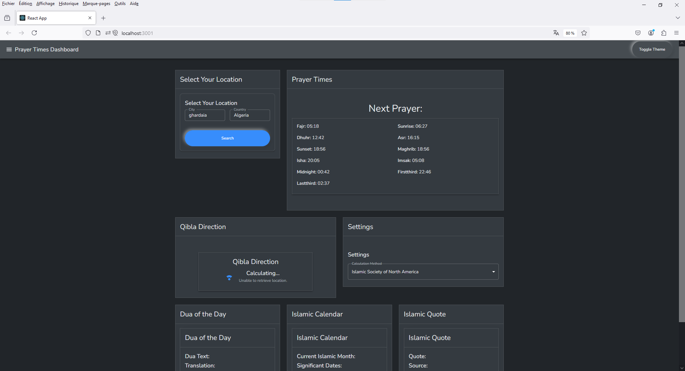

# Prayer-Times

Prayer-Times is a React application providing accurate prayer times based on user location. Features include real-time prayer notifications, a display of current and upcoming prayer times, a Qibla direction guide, and additional Islamic content like daily Dua, quotes, and a calendar.

## Screenshots

  
*Home screen displaying the current and upcoming prayer times.*

  
*Qibla direction guide based on user location.*

## Features

- Accurate prayer times based on user location.
- Real-time notifications for upcoming prayers.
- Display of current and upcoming prayer times.
- Qibla direction guide.
- Daily Dua, Islamic quotes, and an Islamic calendar.
- User-friendly interface with support for multiple languages.
- Regular updates with additional content and features.

## Installation

To run this project locally, follow these steps:

1. Clone the repository:
    ```bash
    git clone https://github.com/username/Prayer-Times.git
    cd Prayer-Times
    ```

2. Install dependencies:
    ```bash
    npm install
    ```

3. Start the development server:
    ```bash
    npm start
    ```

Your app will be running at `http://localhost:3000`.

## Usage

Open the application and allow location access for accurate prayer times. The app will display the current and upcoming prayer times, along with a Qibla direction guide. Explore additional Islamic content such as daily Duas, quotes, and a calendar.

## Contributing

Contributions are welcome! Please fork the repository and submit a pull request with your changes. Ensure your code follows the existing style and includes relevant tests.

## License

This project is licensed under the MIT License - see the [LICENSE](LICENSE) file for details.

## Contact

For any questions or feedback, feel free to reach out:
- Email: idriss.ziadi47@gmail.com
- GitHub: [idrissziadi](https://github.com/idrissziadi)

## Technologies Used

- React
- JavaScript (ES6+)
- HTML/CSS
- Material UI
- Geolocation API
- Islamic Finder API
